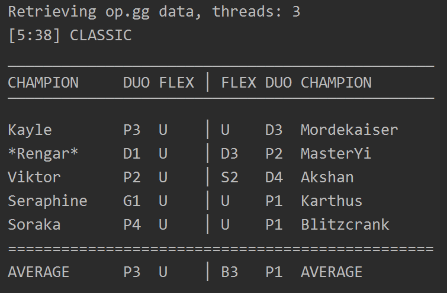

## CLI program for LOL
#### Makes use of RIOT API and the OP.GG website to scrape ranks from previous seasons
For this to work a RIOT API key is required which can be obtained at https://developer.riotgames.com in the dashboard.
 
A normal RIOT API key expires every 24 hours, so if you get status_code 403, just regenerate it.

 
See if the ranks are balanced or if all the odds are against ya.  
Maybe there's a random challenger in your lobby but shouldn't.
